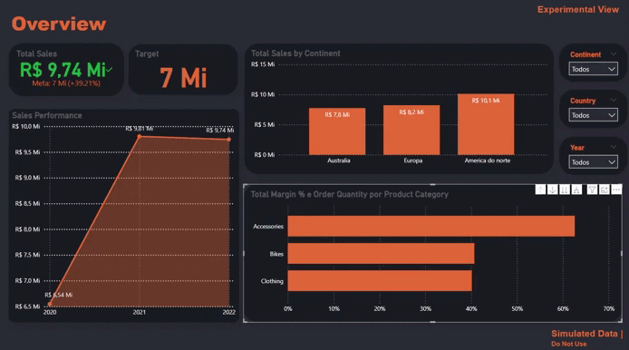
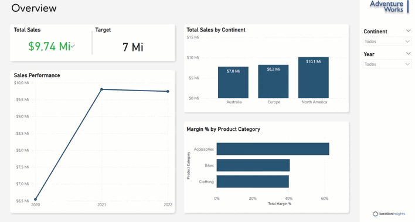

# 🌟 Relatórios Power BI

Bem-vindo ao meu repositório dedicado ao desenvolvimento de relatórios e visualizações interativas criadas no Power BI. Este portfólio apresenta meu trabalho na construção de modelos de layout personalizados, dashboards dinâmicos e análises de dados robustas. Cada relatório foi projetado com o objetivo de proporcionar insights claros, impactantes e de fácil interpretação.

## 📋 Objetivo
Este repositório tem como objetivo compartilhar os relatórios que desenvolvi no Power BI, destacando o uso de técnicas avançadas para transformar dados em insights estratégicos. Aqui, você encontrará:
- **Modelos de Layout Customizados**: Relatórios visuais adaptados para diferentes necessidades e tipos de análise.
- **Visualizações Dinâmicas**: Dashboards interativos, gráficos e tabelas dinâmicas que facilitam a exploração dos dados.
- **Abordagem Analítica Avançada**: Uso de linguagens e ferramentas como DAX e Power Query para manipulação e cálculo de dados.
- **Boas Práticas de Segurança**: Aplicação do conceito de RLS (Segurança em Nível de Linha) para controle de acessos e visualizações restritas.
- **Publicação e Colaboração**: Experiência com o serviço do Power BI para distribuição, colaboração e compartilhamento de relatórios em ambientes corporativos.

## 🎥 Vídeos de Demonstração
Aqui estão dois exemplos de vídeos demonstrando os relatórios desenvolvidos:

<p align="center">
  
</p>
<p align="center">
  
</p>

Esses vídeos destacam a interatividade dos relatórios, bem como a clareza na apresentação dos dados.

## 📁 Estrutura do Repositório
A estrutura deste repositório foi organizada para facilitar a navegação e compreensão dos projetos. Aqui está o formato utilizado:

- **Dados/**: Conjunto de dados utilizados nos relatórios, em formatos como `.csv` ou `.xlsx`.
- **Relatórios/**: Documentação detalhada explicando os objetivos de cada projeto, métricas utilizadas e os insights obtidos.

## ✨ Destaques
### 📊 Técnicas e Ferramentas
- **DAX**: Linguagem utilizada para cálculos avançados e criação de medidas e colunas calculadas, proporcionando flexibilidade e precisão nas análises.
- **Power Query**: Manipulação e transformação de dados para garantir a consistência e qualidade das informações utilizadas nos relatórios.
- **Relacionamentos**: Configuração e otimização de relacionamentos entre tabelas para garantir a correta interação e integridade dos dados.

### 🔒 Segurança e Publicação
- **RLS (Row-Level Security)**: Configuração de segurança para garantir que cada usuário veja apenas os dados que lhes são autorizados.
- **Serviço do Power BI**: Experiência na publicação e compartilhamento de relatórios, facilitando a colaboração e a distribuição segura de informações.

### 🌟 Visualizações Personalizadas
- **Dashboards Dinâmicos**: Relatórios interativos projetados para se ajustarem às necessidades do usuário.
- **Estilo Personalizado**: Uso de cores, layouts e design que destacam os principais insights, tornando os dados claros e acessíveis.

## 🚀 Como Utilizar
Siga as etapas abaixo para explorar os relatórios:

1. **Clone este repositório** para seu ambiente local:
   ```bash
   git clone https://github.com/seu-usuario/nome-do-repositorio.git
